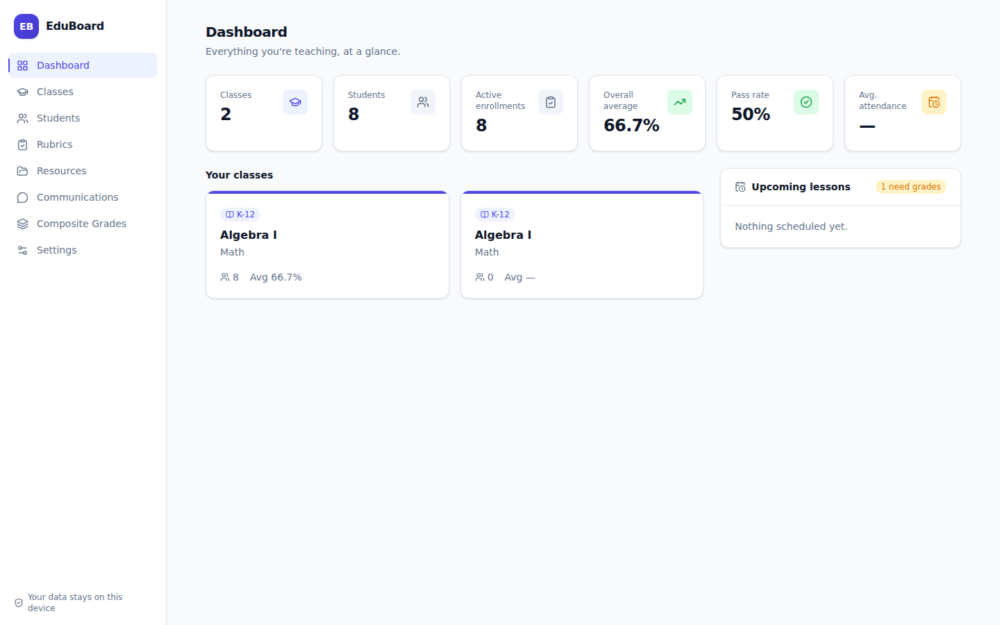
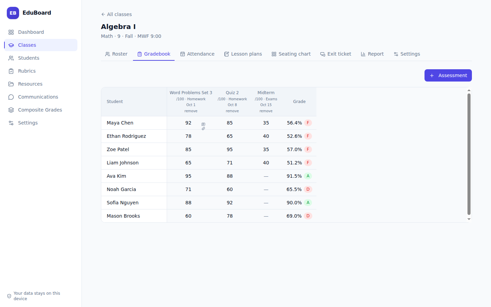
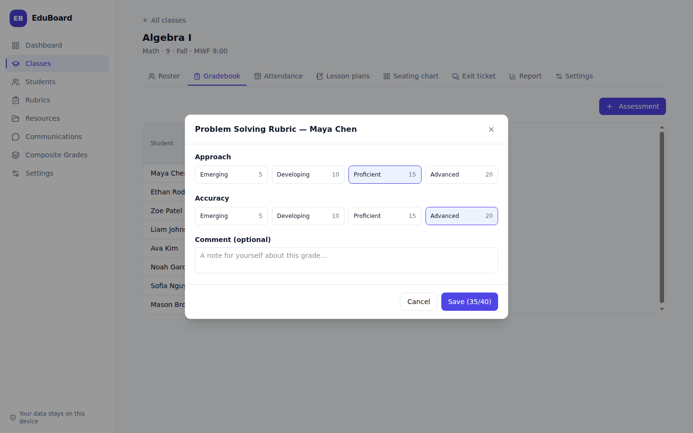
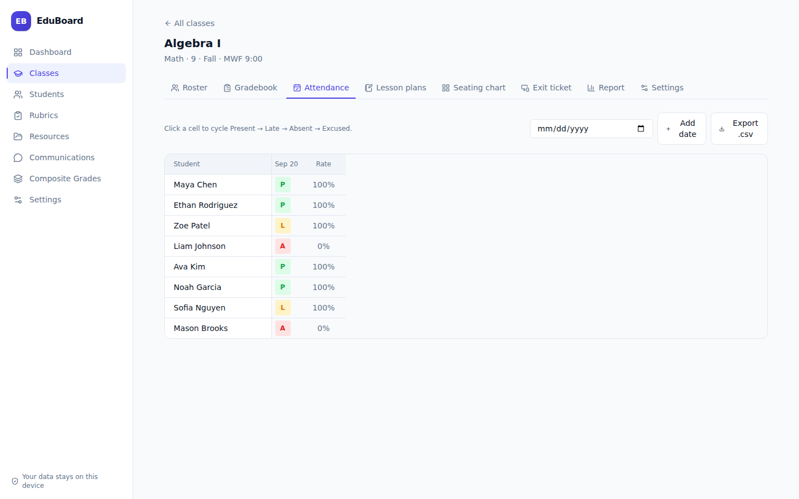
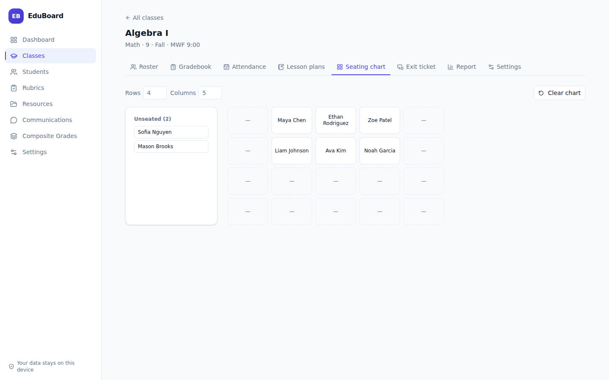
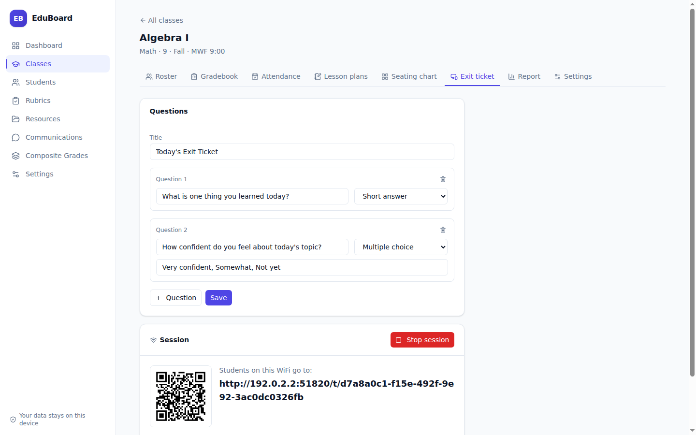
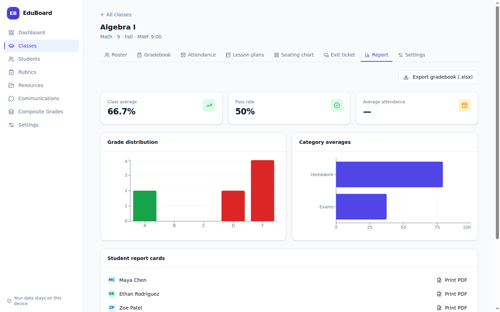
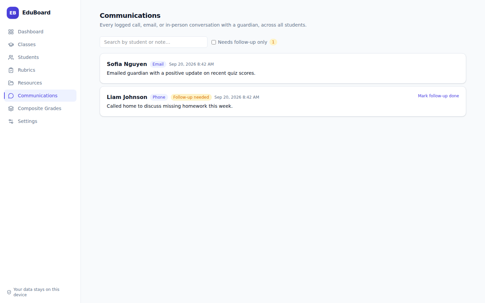
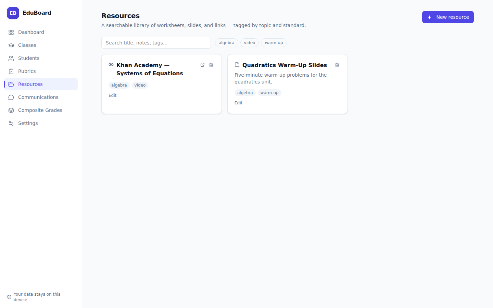
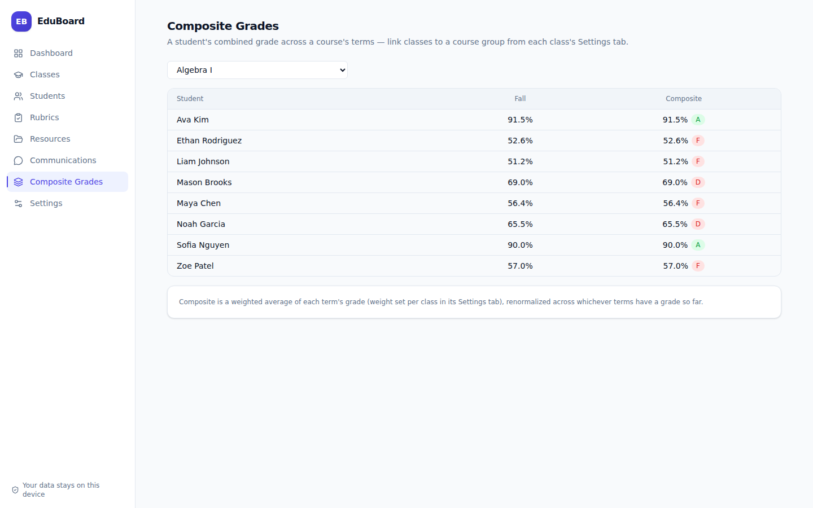

# EduBoard

A local-first teacher operating system: students, classes, gradebook, rubrics, attendance, lesson plans, seating charts, exit tickets, a resource library, parent communications, and reports — all in one desktop app that runs entirely offline, with no account, no server, and no internet required.

Your data lives in a single database file next to the app, so the whole thing — app and data together — can travel on a USB stick between a home laptop and a classroom computer.



## Features

- **Students** — one directory across every class, with guardian contact info and notes.
- **Classes** — K-12, university, or club sections, each with its own grading scale (weighted categories, A–F thresholds, pass mark).
- **Gradebook** — a spreadsheet-style grid per class with keyboard navigation and a per-score change history; grades and letter grades compute live as you type.
- **Rubrics & standards** — build reusable grading rubrics (criteria × performance levels, optionally tagged to your own standards) once and reuse them across any class's assessments; rubric scores flow into the normal grade calculation automatically.
- **Attendance** — click-to-cycle Present/Late/Absent/Excused grid, with attendance rate per student.
- **Lesson planner** — a running list of lessons per class: objectives, materials, activities, homework, linked to an assessment.
- **Assignment submissions** — attach a student's file to any gradebook cell, then open, replace, or remove it straight from the grid.
- **Seating charts** — a configurable rows × columns layout per class: click to place a student, drop one onto another to swap, double-click to unseat.
- **Composite grading** — link a course's sections across terms (e.g. Fall + Spring) into a course group and see each student's weighted grade across the whole year, not just one term.
- **Exit tickets** — a local-network-only session students join from their own device on the classroom WiFi, no internet, no app to install, no account.
- **Resources library** — a searchable, taggable collection of lesson links, files, and notes, linkable to a standard and reusable across every class.
- **Student logs & parent communications** — behavior notes, quick-add entries, and a dedicated log of parent contacts (call/email/in-person) with follow-up tracking, searchable across every student.
- **Reports** — class averages, pass rate, grade distribution, category breakdown, and attendance trend charts; printable per-student report cards (PDF).
- **Import/export** — bring in a roster from `.xlsx`/`.csv`; export a class's full gradebook back to Excel.
- **Backups** — one-click database backup and restore, so you always have a copy that isn't only on one laptop.

| Gradebook | Rubric scoring | Attendance |
| --- | --- | --- |
|  |  |  |

| Seating chart | Exit tickets | Class report |
| --- | --- | --- |
|  |  |  |

| Parent communications | Resources | Composite grades |
| --- | --- | --- |
|  |  |  |

## Download

<p>
  <a href="https://github.com/purysho/EduBoard/releases/latest/download/EduBoard-Portable.exe"></a>
  <a href="https://github.com/purysho/EduBoard/releases/latest/download/EduBoard.dmg"></a>
  <a href="https://github.com/purysho/EduBoard/releases/latest/download/EduBoard.AppImage"></a>
</p>

Each button always grabs the newest release, no version numbers to track. New here? Start with the **[User Guide](docs/USER_GUIDE.md)** for a full walkthrough after installing.

- **Windows** — the button above downloads `EduBoard-Portable.exe`: no install, no admin rights, copy it to a USB stick and double-click it anywhere. EduBoard keeps its database in an `EduBoard-data` folder next to the exe, so the whole thing travels together. Prefer a normal install instead? Grab `EduBoard-Setup.exe` from the [Releases page](https://github.com/purysho/EduBoard/releases/latest) — in that case your data lives in your Windows user profile instead.
- **macOS** — the button above downloads the `.dmg` (universal, works on Intel and Apple Silicon). A `.zip` is also on the [Releases page](https://github.com/purysho/EduBoard/releases/latest) if you'd rather not mount a disk image.
- **Linux** — the button above downloads the `.AppImage`: make it executable (`chmod +x EduBoard.AppImage`) and run it directly.

> Builds aren't code-signed (that costs money neither of us needs to spend for a personal tool). Windows SmartScreen and macOS Gatekeeper will warn you the first time you open it — on Windows choose **More info → Run anyway**; on macOS right-click the app → **Open** the first time. Details and screenshots of both are in the [User Guide](docs/USER_GUIDE.md#installing).

## Everyday use

1. **Settings** → set your name/school and, optionally, terms for the school year.
2. **Classes** → New class → set its level (K-12 / university / club), grading scale, and grade categories (e.g. Homework 40%, Exams 60%).
3. On a class page: **Roster** to enroll students, **Gradebook** to add assessments and enter scores, **Attendance** to mark the day, **Lesson plans** to jot down what you're teaching, **Seating chart** to lay out the room, **Exit ticket** to run a quick end-of-lesson check, **Report** for the class-wide picture and printable report cards.
4. **Resources** (sidebar) for a shared library of files and links, **Communications** (sidebar) to log parent contact across every student, **Composite Grades** (sidebar) once a class is linked to a course group spanning multiple terms.
5. **Settings → Backups** → back up before anything risky (a big import, a term rollover) and occasionally copy the backup file somewhere off the laptop.

Grades use a standard weighted-category model: within a category, it's total points earned over total points possible; the class grade is those category percentages blended by weight, using only categories that have graded work so far (so a mid-term "current grade" is always the average of what's actually been entered, not zeros for missing work).

## Development

```bash
npm install
npm run dev        # launch the app with hot reload
npm run lint        # eslint
npm run typecheck   # tsc, main + renderer
npm test             # vitest (grading/attendance engine + full DB integration tests)
npm run build        # production build (out/)
```

### Building an installer locally

```bash
npm run build:win     # Windows portable exe + NSIS installer (needs Windows, or Wine on Linux/macOS)
npm run build:mac     # macOS dmg + zip (needs macOS)
npm run build:linux   # Linux AppImage
```

Tagging a commit `vX.Y.Z` and pushing the tag triggers [`.github/workflows/release.yml`](.github/workflows/release.yml), which builds all three platforms on their native runners and publishes a draft GitHub Release with every installer attached — that's the intended way to cut a release, since cross-compiling a Windows/macOS build from another OS isn't reliable.

### Code signing

Builds are unsigned until you add the relevant secrets, which is why Windows SmartScreen and macOS Gatekeeper warn on first launch (see the [User Guide](docs/USER_GUIDE.md#installing)). The release workflow and `electron-builder.yml` are already wired to sign and notarize automatically the moment the right repo secrets exist — see [`docs/CODE_SIGNING.md`](docs/CODE_SIGNING.md) for exactly what to add and where to get it. Linux AppImages don't need code signing.

## How it's built

- **Electron + React + TypeScript**, scaffolded with [electron-vite](https://electron-vite.org/).
- **better-sqlite3 + Drizzle ORM** for storage — one `.db` file. On a packaged app it lives next to the executable when that's writable (portable/USB use), and falls back to the OS user-data folder otherwise (see `src/main/db/path.ts`).
- **Hand-rolled versioned migrations** (`src/main/db/migrations.ts`) instead of a drizzle-kit migration folder, so there's nothing extra to ship — see the comment at the top of that file for why.
- **React Query** on top of a typed `window.api` (defined in `src/shared/api.ts`) talking to the main process over IPC (`src/main/ipc/register.ts`).
- **Tailwind CSS v4** for styling, **Recharts** for the report charts.
- **exceljs** for `.xlsx`/`.csv` import and export.
- Report cards print via Electron's own `webContents.printToPDF` against a dedicated print-only route (`/print/student/:studentId/:classId`) rendered in a hidden window — no extra PDF library needed.

### Project layout

```
src/
  main/            Electron main process
    db/            schema, migrations, portable-path resolution, sqlite client
    repositories/   typed CRUD per entity
    services/        grading & attendance calculation engines, reports, backup, import/export
    ipc/              IPC channel handlers
  preload/          contextBridge, exposes the typed window.api
  renderer/src/     React app
    pages/          one folder per module (Dashboard, Students, Classes, Settings, Print)
    components/ui/  small shared UI kit
    lib/            React Query hooks, formatting helpers
  shared/           types/IPC channel names/input types shared by main + renderer
```

## Data model notes

A class defines its own grade categories and weights (or none, for a flat points-based grade). Assessments belong to a category and carry their own max score. A student's grade in a category is `points earned ÷ points possible` for everything graded so far in that category; the class grade blends category percentages by weight, renormalized across categories that actually have graded work. Attendance counts Present and Late as attended, excludes Excused (and unmarked days) from the rate entirely.

## License

MIT
