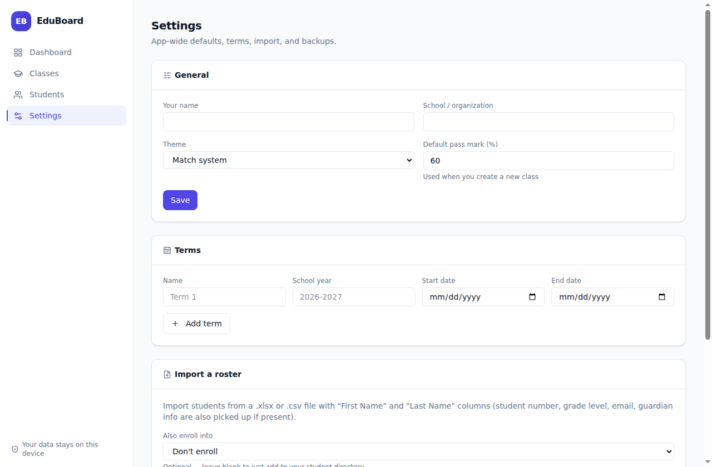
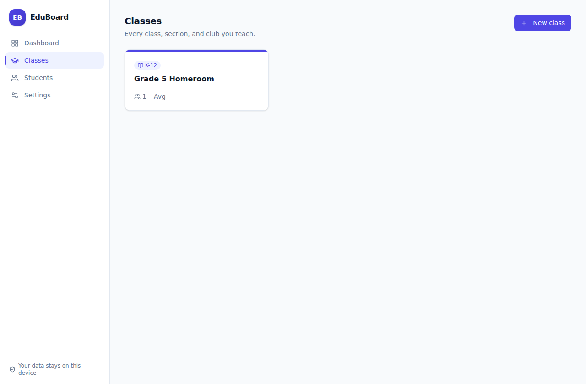
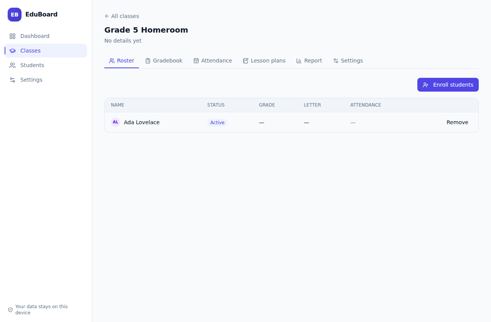

# EduBoard User Guide

A complete walkthrough from downloading EduBoard to running your first term with it. If you just want the short version, the [README](../README.md) covers the basics — this guide goes deeper on every screen.

## Contents

- [Installing](#installing)
- [First launch](#first-launch)
- [Creating your first class](#creating-your-first-class)
- [Adding students](#adding-students)
- [Setting up grading](#setting-up-grading)
- [Using the gradebook](#using-the-gradebook)
- [Taking attendance](#taking-attendance)
- [Planning lessons](#planning-lessons)
- [Reports and report cards](#reports-and-report-cards)
- [Backing up your data](#backing-up-your-data)
- [Carrying EduBoard on a USB stick](#carrying-eduboard-on-a-usb-stick)
- [Troubleshooting](#troubleshooting)

---

## Installing

Download the build for your computer from the buttons at the top of the [README](../README.md) — they always grab the current release.

### Windows

You have two options:

- **Portable (recommended for USB use)** — downloads `EduBoard-Portable.exe`. Put it anywhere (Desktop, a folder, a USB stick) and double-click it. Nothing is installed; EduBoard creates a small `EduBoard-data` folder right next to the exe the first time it runs, and that's where your database lives from then on. Copy the exe *and* that data folder together if you move to another computer.
- **Installer** — downloads `EduBoard-Setup.exe`, from the [Releases page](https://github.com/purysho/EduBoard/releases/latest). Runs a normal Windows install with a Start Menu shortcut. Your data then lives in your Windows user profile instead of next to the app.

The first time you run either one, Windows SmartScreen will likely show **"Windows protected your PC."** This happens because the build isn't code-signed (a signing certificate costs money we don't need to spend for a personal tool) — it does **not** mean anything is wrong with the app. Click **More info**, then **Run anyway**.

### macOS

Download the `.dmg`, open it, and drag EduBoard into your Applications folder (or run it straight from the mounted disk image).

The first time you open it, macOS Gatekeeper will say it **"cannot be opened because the developer cannot be verified."** Right-click (or Control-click) the EduBoard icon and choose **Open**, then confirm **Open** again in the dialog. You only need to do this once — after that it opens normally.

### Linux

Download the `.AppImage`, make it executable, and run it:

```bash
chmod +x EduBoard.AppImage
./EduBoard.AppImage
```

---

## First launch

EduBoard opens on the **Dashboard**, empty. Start in **Settings**:

- **Your name** / **School / organization** — shown on printed report cards.
- **Theme** — light, dark, or match your system.
- **Default pass mark** — pre-fills new classes; you can still override it per class.
- **Terms** (further down the Settings page) — optional. Add a term (e.g. "Term 1", school year "2026-2027") if you want to tag classes by term. Skip this if you don't need it — a class works fine with no term set.



Nothing here is permanent — all of it can be changed later, per-class settings included.

---

## Creating your first class

Go to **Classes → New class**. Fill in:

- **Class name** — whatever you'd naturally call it: "Grade 5 Homeroom", "AP English 11", "Robotics Club".
- **Level** — K-12, University, Club, or Other. This is just a label (shown as a badge) — it doesn't change what the class can do.
- **Grade level / year**, **Term**, **Schedule**, **Room** — all optional, free text.

Save, and you're on the class page with six tabs: **Roster, Gradebook, Attendance, Lesson plans, Report, Settings**. Every one of these is scoped to this class — grades, attendance, and lesson plans never leak between classes, but a student can be enrolled in several at once (a homeroom teacher who also runs a club, for example).



---

## Adding students

Two ways to get students into a class, both from the **Roster** tab:

1. **Enroll students → pick from your directory.** Anyone already added (in this class or another) shows up in the search list.
2. **Enroll students → + New.** Adds a brand-new student to your directory *and* enrolls them in this class in one step. Fill in first/last name at minimum — everything else (student number, grade level, guardian contact, notes) is optional and can be added later from the student's own profile page (click their name anywhere in the app).



For a whole class at once, skip manual entry — see [Importing a roster](#importing-a-roster) below.

### Importing a roster

**Settings → Import a roster.** Point it at an `.xlsx` or `.csv` file with **"First Name"** and **"Last Name"** columns (a few common header spellings are recognized). It also picks up, when present: student number/ID, grade level, email, guardian name, guardian contact, notes. Optionally choose a class to enroll everyone into as they're imported — or leave that blank to just add them to your directory without enrolling anyone yet.

---

## Setting up grading

Each class has its own grading scale, in **that class's Settings tab** (not the app-wide Settings page):

- **Pass mark** and **A/B/C/D thresholds** — percentages. Below the D threshold is an F.
- **Grade categories** — e.g. "Homework" (40%) and "Exams" (60%). Optional: skip categories entirely and every assessment counts equally by points.

**How the math works:** within a category, the grade is *points earned ÷ points possible* across every graded assessment in it. The class grade blends category percentages by their weight — but only counts categories that actually have graded work yet, reweighting the rest to fill the gap. That's why a "current grade" mid-term is always the average of what's actually been entered, never zeros for work that hasn't happened.

If your weights don't add to 100%, EduBoard tells you (categories with data are renormalized automatically, but it's worth fixing).

---

## Using the gradebook

**Gradebook → + Assessment** to add a quiz, homework set, exam, or anything else you grade — name, category, date, and max score.

Enter scores directly in the grid: click a cell, type a number, click away (or press Enter) to save. Each student's live percent and letter grade show in the rightmost column, updating as you go.


Click an assessment's name in the column header to edit it, or "remove" underneath to delete it (this also deletes every score recorded for it).

---

## Taking attendance

**Attendance** shows a grid: students down the side, dates across the top. Click a cell to cycle **Present → Late → Absent → Excused**. Present and Late both count as "attended"; Excused (and any day with no mark at all) is left out of the rate entirely, so a student's percentage only reflects days they were actually expected.


Today's date is there by default — add more with the date picker and **+ Add date** as the term goes on.

---

## Planning lessons

**Lesson plans** is a running list, newest additions included. Each entry has a date, status (Planned / Taught / Skipped), title, objectives, materials, activities, homework, and an optional link to one of the class's assessments (handy for tracing which lesson a quiz grew out of). Nothing here is required — use as much or as little structure as is useful to you.

---

## Reports and report cards

**Report** (per class) shows:

- Class average, pass rate, and average attendance as headline numbers.
- Grade distribution (how many students landed in each letter grade).
- Category averages (which part of the grade the class is strongest/weakest in).
- An attendance trend line once there's more than one date recorded.
- **Export gradebook (.xlsx)** — every assessment, every score, and the computed grade, as a spreadsheet you can open in Excel or hand to an administrator.
- **Print PDF** next to each student's name — a one-page report card (grade, category breakdown, every assessment score, attendance summary) rendered straight to PDF, no extra software needed.


The **Dashboard** rolls all of this up across every class at once — total students, overall average, pass rate, attendance, and what's coming up in your lesson plans.


---

## Backing up your data

**Settings → Backups → Back up now** makes a timestamped copy of your entire database. Do this before anything you'd hate to redo (a big import, end of term) — it takes a second. **Open folder** shows you where backups live on disk, so you can copy one to a USB stick, a cloud-synced folder, or email it to yourself.

**Restore** replaces everything currently in EduBoard with a chosen backup and restarts the app — use it if something goes wrong or you're setting up on a new computer from an old backup.

There's no auto-sync or cloud anything here on purpose: EduBoard doesn't talk to the internet at all. Backups are the whole safety net, so it's worth actually using them.

---

## Carrying EduBoard on a USB stick

This is what the **portable** Windows build (and, less formally, the macOS `.app` or Linux AppImage) is for:

1. Copy `EduBoard-Portable.exe` (or the `.AppImage`, or the extracted `.app`) onto the USB stick.
2. Run it once from the stick — it creates its data folder right there next to itself.
3. From then on, plug the stick into any compatible computer and run the exe directly off it. Your classes, students, grades, and attendance travel with it, no install needed on the host machine.

Two things worth knowing:
- Writing to a USB stick is slower than a local disk, so very large rosters may feel a little less snappy — fine for typical class sizes.
- Back up periodically (see above) — a lost or corrupted USB stick is the one single point of failure in this setup, same as it would be for any file you keep only on a flash drive.

---

## Troubleshooting

**Windows says "Windows protected your PC" / macOS says the app "cannot be opened."**
Expected — see [Installing](#installing) above. It's a code-signing warning, not a real error.

**I imported a roster and some students didn't show up.**
Check the import result message: rows missing a first *and* last name are skipped and reported, not silently dropped. Fix the source file and re-import — duplicate students aren't automatically merged, so check your directory for repeats if you import the same file twice.

**A student's grade shows "—" even though I entered scores.**
Grades only compute once a category (or the whole class, if you're not using categories) has at least one graded assessment. If you're using categories, an assessment must be assigned to one for it to count toward category-weighted totals — assessments left "Uncategorized" still count, just folded in unweighted.

**I want to move EduBoard's data to a different computer.**
Use **Settings → Backups**, make a fresh backup, copy the `.db` file to the new machine (or the new machine's version of EduBoard), and use **Restore** to load it. For the portable build, it's simpler still: just copy the exe and its `EduBoard-data` folder together.

**Something looks broken.**
Please open an issue on the [GitHub repo](https://github.com/purysho/EduBoard/issues) with what you were doing and what you expected instead — screenshots help a lot.
