# EduBoard User Guide

A complete walkthrough from downloading EduBoard to running your first term with it. If you just want the short version, the [README](../README.md) covers the basics — this guide goes deeper on every screen.

## Contents

- [Installing](#installing)
- [First launch](#first-launch)
- [Creating your first class](#creating-your-first-class)
- [Adding students](#adding-students)
- [Setting up grading](#setting-up-grading)
- [Using the gradebook](#using-the-gradebook)
- [Grading with rubrics](#grading-with-rubrics)
- [Starting the next term](#starting-the-next-term)
- [Composite grading across terms](#composite-grading-across-terms)
- [Taking attendance](#taking-attendance)
- [Planning lessons](#planning-lessons)
- [Seating charts](#seating-charts)
- [The Classroom tab](#the-classroom-tab)
- [Exit tickets](#exit-tickets)
- [Resources library](#resources-library)
- [Students using AI](#students-using-ai)
- [Student logs and parent communications](#student-logs-and-parent-communications)
- [Reports and report cards](#reports-and-report-cards)
- [Weekly digest, your week and newsletters](#weekly-digest-your-week-and-newsletters)
- [Word, PowerPoint and Excel](#word-powerpoint-and-excel)
- [Your school's look and settings](#your-schools-look-and-settings)
- [Password protection](#password-protection)
- [Presenting on a projector](#presenting-on-a-projector)
- [A student's or family's data request](#a-students-or-familys-data-request)
- [Backing up your data](#backing-up-your-data)
- [Carrying EduBoard on a USB stick](#carrying-eduboard-on-a-usb-stick)
- [Troubleshooting](#troubleshooting)

---

## Installing

Download the build for your computer from the buttons at the top of the [README](../README.md) — they always grab the current release.

### Windows

You have two options:

- **Portable (recommended for USB use)** — downloads `EduBoard-Portable.exe`. Put it anywhere (Desktop, a folder, a USB stick) and double-click it. Nothing is installed; EduBoard creates a small `EduBoard-data` folder right next to the exe the first time it runs, and that's where your database lives from then on. Copy the exe *and* that data folder together if you move to another computer.
- **Installer** — downloads `EduBoard-Setup.exe`, from the [Releases page](https://github.com/purysho/EduBoard/releases/latest). Runs a normal Windows install with a Start Menu shortcut. Your data then lives in your Windows user profile instead of next to the app.

The first time you run either one, Windows SmartScreen will likely show **"Windows protected your PC."** This happens because the build isn't code-signed (a signing certificate costs money we don't need to spend for a personal tool) — it does **not** mean anything is wrong with the app. Click **More info**, then **Run anyway**.

### macOS

Download the `.dmg`, open it, and drag EduBoard into your Applications folder (or run it straight from the mounted disk image).

The first time you open it, macOS Gatekeeper will say it **"cannot be opened because the developer cannot be verified."** Right-click (or Control-click) the EduBoard icon and choose **Open**, then confirm **Open** again in the dialog. You only need to do this once — after that it opens normally.

### Linux

Download the `.AppImage`, make it executable, and run it:

```bash
chmod +x EduBoard.AppImage
./EduBoard.AppImage
```

---

## First launch

EduBoard opens on the **Dashboard** with a **Getting started** checklist at the top: create a class, add students, publish an assignment, connect the student Portal, and invite your students (plus two optional extras: sharing study material and adding an AI key). Each step has a button that takes you where it's done, and ticks itself once it really is done. Click **I'll do this later** to hide it; **Settings → Show getting-started checklist** brings it back.

A good first stop is **Settings**. Its menu on the left splits it into sections: **You and your school**, **Appearance**, **Grading and reports**, **Class lists**, **Portal and families**, **AI**, **Data and security** and **Help and updates**. **Search settings** at the top of the menu finds the right section by what you type (for example "backup" or "comment"). Each box has its own **Save**; "Not saved yet." next to it means you've changed something there, and **Undo changes** puts it back.

- **You and your school → Your name** / **School / organization** — shown on printed report cards.
- **You and your school → Theme** — light, dark, or match your system.
- **You and your school → Language** — English or 中文 (Simplified Chinese). It changes straight away, and **中文 / EN** at the bottom of the sidebar switches in one click. Until you choose, EduBoard follows the computer's language. Everything changes: screens, printouts, the pages students open for exit tickets and check-in, and the built-in comment bank and parent letter (unless you've edited them).
- **Grading and reports → Default pass mark** — pre-fills new classes; you can still override it per class.
- **Grading and reports → Terms** — optional. Add a term (e.g. "Term 1", school year "2026-2027") if you want to tag classes by term. Dates are optional too, and **Edit** changes a term's name or dates any time, so you can add Term 2 before its dates are fixed and fill them in later. Skip this if you don't need it — a class works fine with no term set.

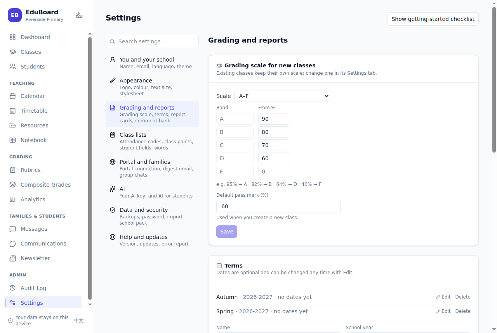

Nothing here is permanent — all of it can be changed later, per-class settings included.

---

## Creating your first class

Go to **Classes → New class**. Fill in:

- **Class name** — whatever you'd naturally call it: "Grade 5 Homeroom", "AP English 11", "Robotics Club".
- **Level** — K-12, University, Club, or Other. This is just a label (shown as a badge) — it doesn't change what the class can do.
- **Grade level / year**, **Term**, **Schedule**, **Room** — all optional, free text.

Save, and you're on the class page with eight tabs: **Roster, Gradebook, Attendance, Lesson plans, Seating chart, Exit ticket, Report, Settings**. Every one of these is scoped to this class — grades, attendance, and lesson plans never leak between classes, but a student can be enrolled in several at once (a homeroom teacher who also runs a club, for example).

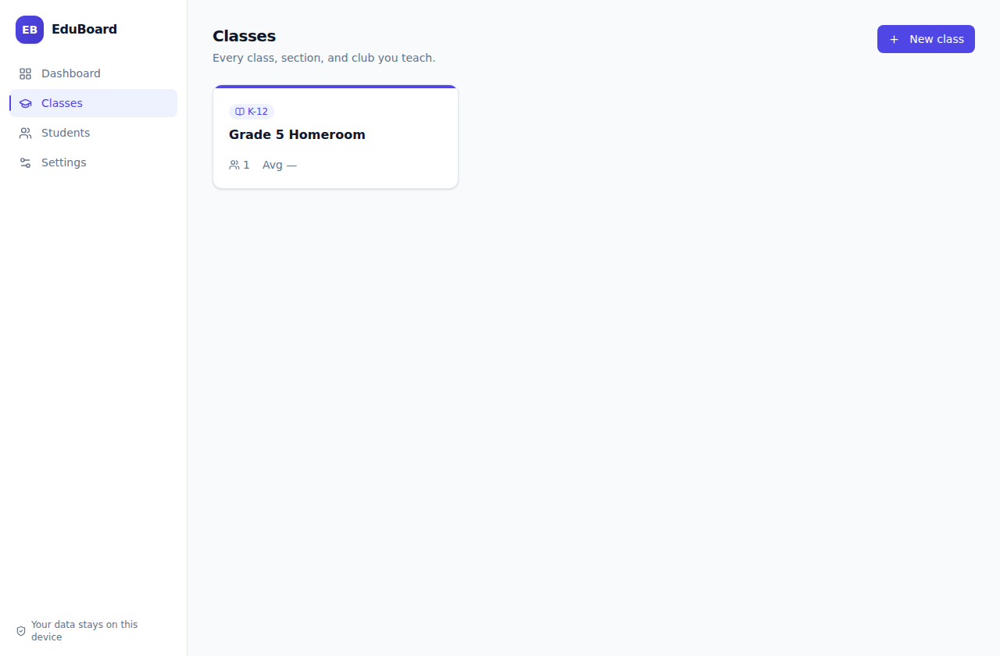

---

## Adding students

Two ways to get students into a class, both from the **Roster** tab:

1. **Enroll students → pick from your directory.** Anyone already added (in this class or another) shows up in the search list.
2. **Enroll students → + New.** Adds a brand-new student to your directory *and* enrolls them in this class in one step. Fill in first/last name at minimum — everything else (student number, grade level, guardian contact, notes) is optional and can be added later from the student's own profile page (click their name anywhere in the app).

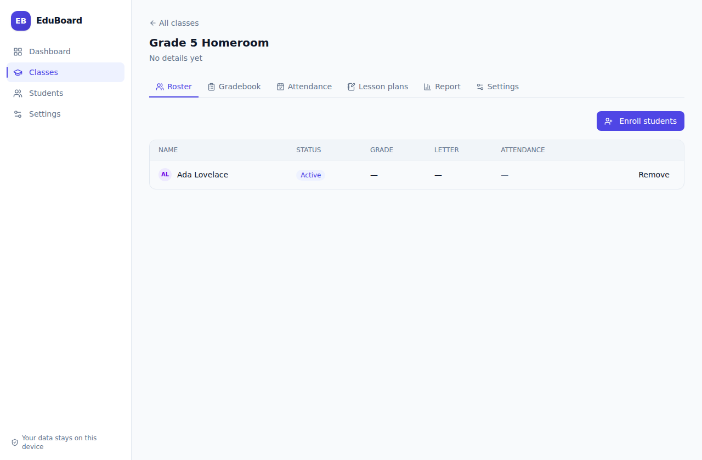

A student's own profile page (click their name anywhere) shows their details, every class they're enrolled in with its current grade, and their log (see [Student logs and parent communications](#student-logs-and-parent-communications)).

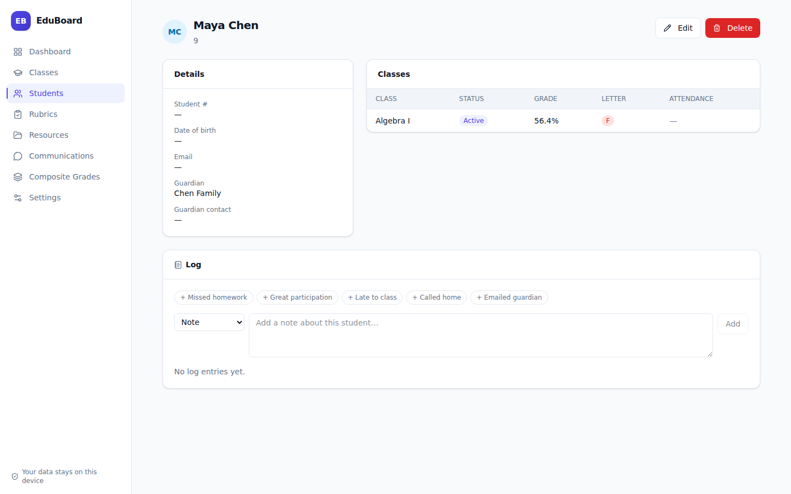

For a whole class at once, skip manual entry — see [Importing a roster](#importing-a-roster) below.

### Importing a roster

**Settings → Data and security → Import a roster.** Point it at an `.xlsx` or `.csv` file with **"First Name"** and **"Last Name"** columns (a few common header spellings are recognized). It also picks up, when present: student number/ID, grade level, email, guardian name, guardian contact, notes. Optionally choose a class to enroll everyone into as they're imported — or leave that blank to just add them to your directory without enrolling anyone yet.

---


### A student's timeline

At the bottom of a student's page, **Timeline** lists everything recorded about them, newest first and grouped by month, across every class they're in: absences and lateness (with any note), scores, class points (a line a day), log notes and parent contacts (marked when a follow-up is still needed), homework handed in and its grade, report card comments, when they joined each class, and, when the Portal is connected, messages with their family. Click the chips above it to show or hide each kind, and choose a class to see just that class. It's the view to open before a parent meeting.
## Setting up grading

Each class has its own grading scale, in **that class's Settings tab** (not the app-wide Settings page):

- **Pass mark** and **A/B/C/D thresholds** — percentages. Below the D threshold is an F.
- **Grade categories** — e.g. "Homework" (40%) and "Exams" (60%). Optional: skip categories entirely and every assessment counts equally by points.

**How the math works:** within a category, the grade is *points earned ÷ points possible* across every graded assessment in it. The class grade blends category percentages by their weight — but only counts categories that actually have graded work yet, reweighting the rest to fill the gap. That's why a "current grade" mid-term is always the average of what's actually been entered, never zeros for work that hasn't happened.

If your weights don't add to 100%, EduBoard tells you (categories with data are renormalized automatically, but it's worth fixing).

---

### Grading scales

A class's **Settings** tab has its **Grading scale**. Choose A–F (the default), A–F with + and −, 优秀 / 良好 / 合格 / 待合格, 优秀 / 良好 / 中等 / 及格 / 不及格, 1–7, 9–1, Pass / Fail, or **Your own…**, then set where each band starts. The example line underneath shows what a few percents would get. Everything that shows a letter (gradebook, report cards, class report, composite grades, the Portal) uses the class's own labels. **Settings → Grading and reports → Grading scale for new classes** sets the scale new classes start with. Pass rates still use the class's pass mark.

## Using the gradebook

**Gradebook → + Assessment** to add a quiz, homework set, exam, or anything else you grade — name, category, date, and max score.

Enter scores directly in the grid: click a cell, type a number, click away (or press Enter) to save. Each student's live percent and letter grade show in the rightmost column, updating as you go.

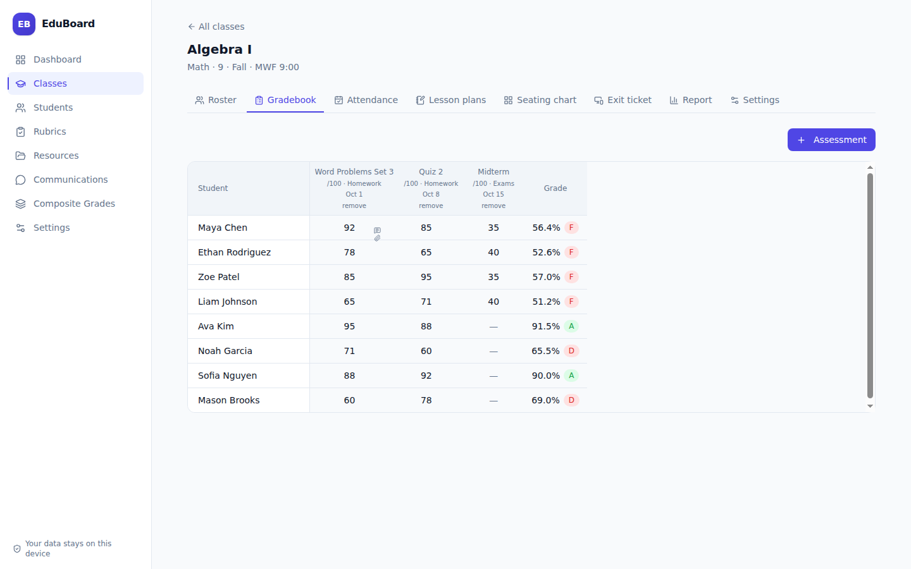

Click an assessment's name in the column header to edit it, or "remove" underneath to delete it (this also deletes every score recorded for it).

**Move around the grid with the keyboard** — arrow keys jump between cells, Enter saves and moves down; this works the same whether a cell is a plain score or a rubric-graded one. Hover a cell you've already graded to reveal a small clock icon showing its change history, useful if a grade is ever disputed, and a speech-bubble icon to leave yourself a private comment on that grade.

**Attaching a submission** — hover any gradebook cell and a paperclip icon appears (it stays visible once a file's attached). Click it to attach a file from anywhere on your computer; click it again to **Replace** with a new file or **Remove** it, or click the filename to open it in your system's default app for that file type. Only one submission is kept per student per assessment — attaching a new one replaces the old, it doesn't pile up a history. EduBoard remembers where the file lives on disk rather than copying it in, so keep the original in place (or re-attach it) if you move it.

---

### Importing scores from a spreadsheet

**Import scores** at the top of the Gradebook brings in scores from an exam system or a colleague's spreadsheet (.xlsx or .csv, with headings in row 1 and a row per student).

1. **Choose a spreadsheet.** For a workbook with several sheets, pick the sheet.
2. **Where are the students?** EduBoard picks a student number column if the sheet has one, otherwise a name column (Mai Chen, Chen Mai, "Chen, Mai" and 陈麦 all match), otherwise first and last name columns. Change it if it guessed wrong.
3. **Which columns are scores?** Every column that's mostly scores is ticked. Each goes into the assessment with the same name, or **A new assessment** (name it, and set what it's out of; a heading like "Unit test (/50)" or "期中（满分120）" fills that in). Untick a column to leave it out.
4. **Check what will change:** how many rows matched, rows that didn't match a student, cells left out and why (not a score, more than the maximum, below zero), and every score it would replace, old → new. Nothing is saved until you click **Import**.

"EX" or 免考 in a cell marks the student excused; a percentage such as 85% becomes points out of the maximum. Imported scores keep their history, like scores typed into the gradebook, so the score history shows what the import changed.

## Grading with rubrics

**Rubrics** (in the sidebar) is a reusable library, separate from any one class — build a rubric once and attach it to assessments in any class.

- **Rubric library tab → New rubric.** Give it a name, then add criteria (e.g. "Thesis," "Evidence"). Each criterion gets its own performance levels — a label, a point value, and an optional description (e.g. "Excellent" / 4 / "Clear, arguable thesis in the opening paragraph"). Optionally tag a criterion with one of your standards. The rubric's max score is the sum of each criterion's highest-point level.
- **Standards tab** is your own list of standards (Common Core, state, or anything you define) — just a code and description. Nothing is bundled; you add what you use.
- **Attaching a rubric to an assessment**: in **Gradebook → + Assessment**, pick a rubric from the "Grade with a rubric" dropdown. The assessment's max score locks to the rubric's total automatically.
- **Grading**: a rubric-graded assessment's gradebook cells become buttons — click one to open the rubric, pick a performance level for each criterion, and save. The total is computed automatically and shows up everywhere a normal score would — the gradebook, class report, and dashboard — no different from typing a number in.

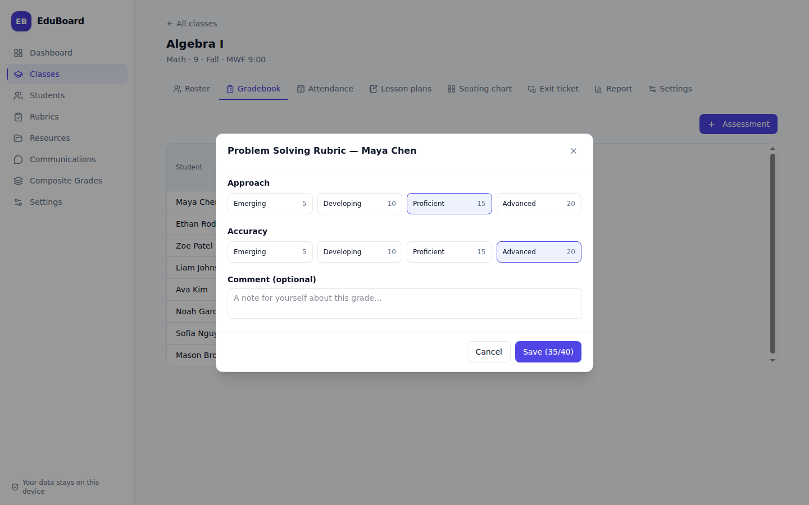

Editing a rubric later preserves a student's existing scores wherever the criterion or level you're editing is the same one (fixing a typo doesn't lose data); only criteria or levels you actually remove take their recorded scores with them.

---

## Attendance requirements

If a course needs a minimum attendance (say 80%), set it in the class's **Settings → Attendance requirement**. Students below it appear on the Dashboard under **Below the attendance requirement**, with their rate and how many sessions it's based on. They're only listed once they've had three sessions, and excused absences don't count against them. **Start next term** carries the requirement over.

## Duplicate students

If the same person ends up on your list twice (for example they joined through a class link as "Chen Mai" when you already had "Mai Chen"), the **Students** page shows them under **Possible duplicates**. Click **Review and merge**, check which record to keep (the arrows swap them), and **Merge**. Everything moves to the kept record: classes, scores, attendance, work, notes and their Portal login, so they carry on signing in as before. A backup is taken first. You can also merge from any student's page with **Merge**.

Class join links now match names in either order, so this should rarely happen.

## Starting the next term

When a class carries on into a new term, open the class's **Settings** tab and click **Start next term**. It makes a new class with the same grading scale, categories and course group, under the term you pick (the one after the current class's term is chosen for you).

Leave **Bring the students across** ticked to enrol the same students in the new class. They're the same students, not copies, so anyone who already has a Portal account doesn't sign up again: the new class appears in their Portal after your next **Publish**. Students who dropped the old class stay behind. Grades, attendance and homework stay with the old class.

**All your classes at once:** on the **Classes** page, **Start next term** lists the classes in the term that's ending (picked for you: the term most of your classes are in) and makes a next-term class for each one you leave ticked, under the next term. It can bring the students across, keep the same timetable (so the Dashboard's **Today** card carries on), and archive the old classes in the same step. A class the next term already has is left alone, so running it twice doesn't make doubles. A backup is taken first.

When the old term is over, **Archive** it (class Settings → Archive). It leaves your class list, and on the Portal students see it under **Finished classes**: their grades, feedback, work and materials stay readable, but nothing more can be handed in and its join links stop working.

## Composite grading across terms

If a course runs across multiple terms (Fall and Spring sections of the same class, say), you can see one student's grade across the whole thing instead of just one term at a time. **Start next term** keeps the course group, so the two terms are linked already.

1. On each term's class, go to **Settings → Course group** and either pick an existing course group or type a name to create a new one — this is what ties "Algebra I (Fall)" and "Algebra I (Spring)" together as the same course.
2. Optionally set that class's **weight in composite** — how much this term counts relative to the group's others. Leave it at 1 to weight every linked term equally.
3. Open **Composite Grades** in the sidebar and pick the course group. You'll see every enrolled student, their percent in each linked term, and a weighted composite (with a letter grade).

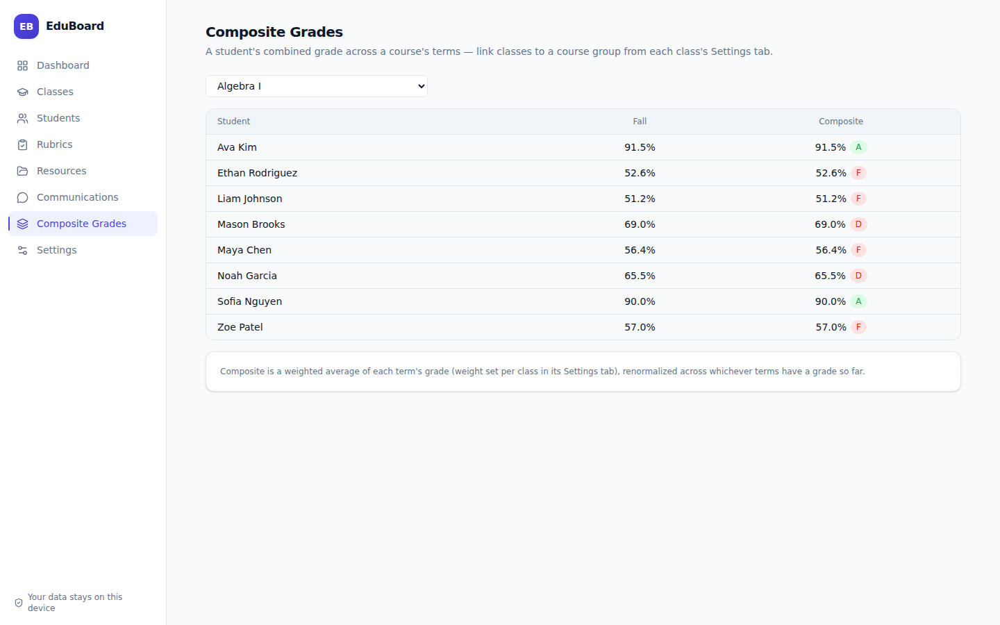

The composite is renormalized across whichever terms actually have graded work — a term that hasn't started yet doesn't drag the composite down, the same way an ungraded category doesn't drag down a single class's grade.

At the end of the year, **Export grade sheet** (next to the course picker) saves one Excel file for the course: a **Final grades** sheet with each student's grade and letter for every term, the final combined grade, and attendance, followed by each term's full gradebook on its own sheet.

---

## Taking attendance

**Attendance** shows a grid: students down the side, dates across the top. Click a cell to cycle **Present → Late → Absent → Excused**. Present and Late both count as "attended"; Excused (and any day with no mark at all) is left out of the rate entirely, so a student's percentage only reflects days they were actually expected.

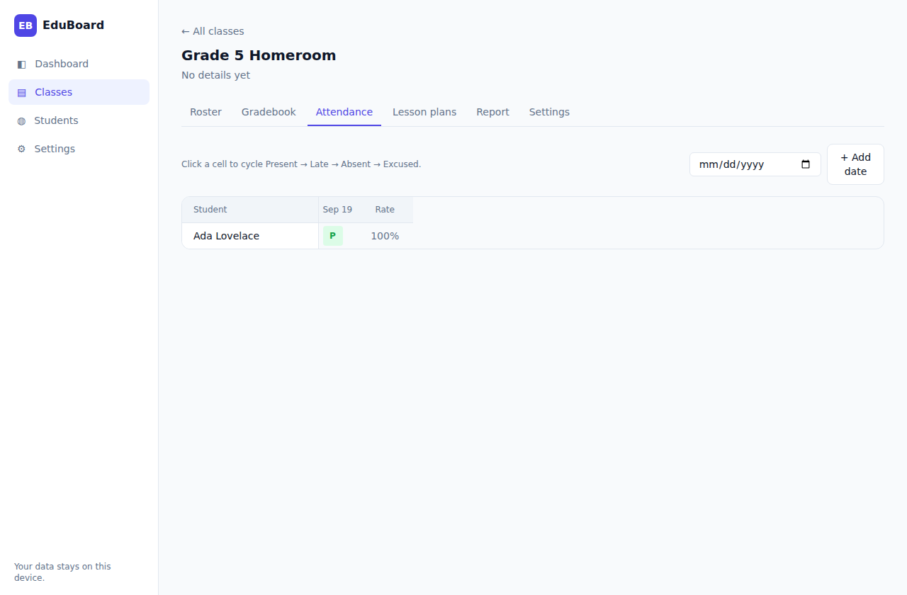

Today's date is there by default — add more with the date picker and **+ Add date** as the term goes on.

---

## Planning lessons

**Lesson plans** is a running list, newest additions included. Each entry has a date, status (Planned / Taught / Skipped), title, objectives, materials, activities, homework, and an optional link to one of the class's assessments (handy for tracing which lesson a quiz grew out of). Nothing here is required — use as much or as little structure as is useful to you.

**Copy last week** copies every plan from last week (Monday to Sunday) to the same day this week, marked Planned, so a repeating timetable only needs editing rather than retyping. Plans already there with the same date and title aren't copied twice.

---

## Seating charts

**Seating chart** (per class) is a grid you lay out yourself — set **Rows** and **Columns** at the top to match your actual room.

- **Placing a student**: click a name in the **Unseated** list on the left, then click an empty seat to place them there.
- **Moving a student**: click their occupied seat (it highlights as selected), then click the seat you want to move them to. If that seat is already taken, the two students swap places — nobody gets bumped to "unseated" by accident.
- **Unseating a student**: double-click their seat directly, or click it once to select them and don't click a destination.
- **Shrinking the grid**: if you reduce Rows or Columns and a student's seat falls outside the new size, they're automatically moved back to the Unseated list rather than left stuck in a seat you can no longer see.

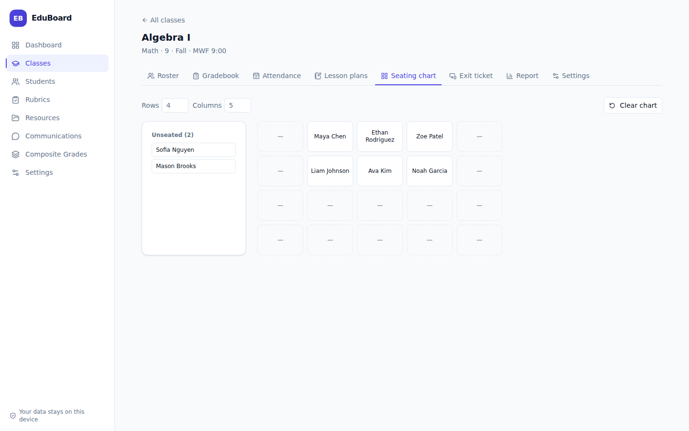

The layout is saved per class automatically — no separate save step.

**Give points** (top right) turns the chart into a way to give class points: pick what the point is for, then tap a seat for +1 or its **−** for −1. Each seat shows the student's points this week, the same as the Classroom tab. **Arrange seats** switches back.

If a student field is marked **Show on the seating chart** (in **Settings → Class lists → Extra student fields**, next to the field's name), a seat shows a small ⓘ when something is recorded in it for that student, such as an allergy or a support plan. Point to it to read it. The icons are hidden while presenting.

---

## The Classroom tab

Each class has a **Classroom** tab for the lesson itself. It's fine to put on the projector, and stays visible in presenting mode.

- **Random name**: press **Pick a name**. Nobody comes up twice until everyone has had a turn; **Start again** resets the round.
- **Groups**: choose **Groups of** a size or a **Number of groups**, then **Make groups**. **Shuffle** until you like them.
- **Timer**: pick 1–15 minutes, **Start**, **Pause**, **Reset**. The corner button makes it full screen, and it chimes when time's up.
- **Class points**: pick what the point is for, then tap a student's name for +1, or **−** to take one away. Totals start again each Monday; **Undo last** takes back a mis-tap. What points are for is set in **Settings → Class lists → What class points are for**: rename EduBoard's five (Helping others, On task…), add your own, or **Use a ready-made set** such as 德智体美劳 or Respect / Effort / Teamwork. A category you stop using is hidden, not deleted. Report cards show each student's points per category (switch it off in **Settings → Grading and reports → Report cards**), and the family digest can show the past week's.

Students marked **absent** or **excused** today are left out of the picker and groups (untick the box at the top to include them).

## Exit tickets

An exit ticket is a quick 1–3 question check students answer on their own device (phone, tablet, laptop) over the classroom WiFi — no internet connection, app install, or account needed on their end.

1. **Exit ticket** (per class) → write up to 3 questions (short answer or multiple choice) and **Save**.
2. Choose how long it stays open (**Close by itself after** 5, 10, 15 or 30 minutes, or **Never**), then **Start session**. EduBoard starts a small local server and shows a QR code plus a web address. Students on the same WiFi scan the QR code or type the address into their browser.
3. Students **choose their name from the class list**, answer and submit. If a student submits again, the new answer replaces the old one, so there's one answer per student. Responses appear in the **Responses** list live, and **Not answered yet** lists who's missing.
4. The session closes by itself at the time you chose, or press **Stop session**. **Clear** wipes the recorded responses if you want to reuse the same questions with another class.

A class with no students enrolled yet falls back to students typing their name. Each device can send about a dozen answers a minute, which is plenty for a real student and stops anyone flooding the list.

**QR attendance check-in** (Attendance tab) works the same way: students scan the code and tap their own name. Each phone can check in one student per session, so nobody can mark a friend present from their phone; they're told to ask you instead. You can still tick anyone present or absent yourself in the attendance grid.

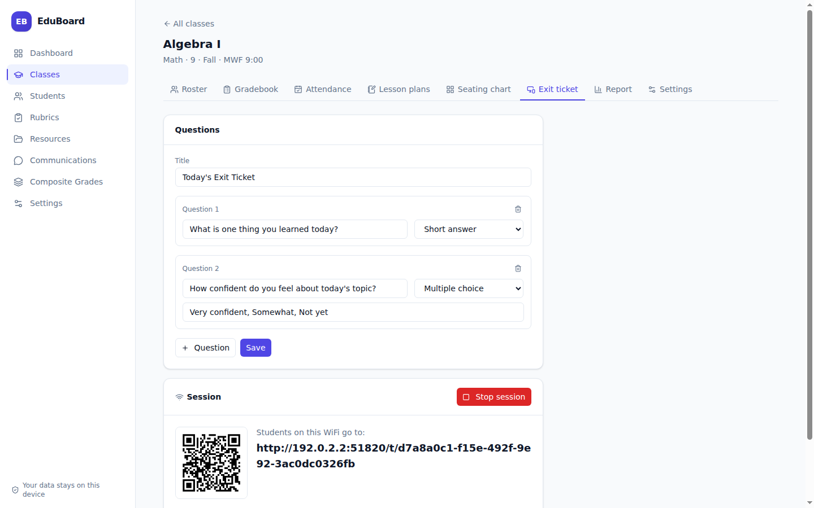

Because everything happens over your local WiFi rather than the internet, this works in classrooms with no outside network access — the only requirement is that the teacher's computer and students' devices share the same WiFi network. If a student's device shows "no exit ticket is open," check that the session is still started and that they're on the same network as the teacher's computer.

---

## Resources library

**Resources** (sidebar) is a searchable library of lesson links, files, and notes — not tied to any one class, so you build it up once and reuse it everywhere.

- **New resource** → choose a type (**Link**, **File**, or **Note**), give it a title, and fill in the URL or pick a file from your computer (for File) or just write the note (for Note). Add tags (comma-separated) and, optionally, one of your standards to make it easy to find later.
- Filter by typing in the search box or clicking a tag chip; click a link or file resource to open it in your browser or default app, or click a note to view/edit it.
- Files are referenced by their path on disk, the same as gradebook submissions — keep the original file where EduBoard can find it.
- **Study tools (needs an AI key in Settings):** **Study guide**, **Flashcards** and **Practice quiz** each draft a study aid from the resource's text. They work on PDFs, Word (.docx), PowerPoint (.pptx, including speaker notes), OpenDocument, .txt and .md files, links and notes, and index the resource themselves the first time. Older .doc/.ppt files need saving as .docx/.pptx first; scanned PDFs (pictures of pages) have no text to read. Flashcards and quizzes open in a review window where you can read every card and question (the correct answer is ticked) and **Regenerate** or **Remove** them. If the resource is shared with a class, students get them on the Portal to practise with; the practice quiz is self-checked and never counts toward a grade.

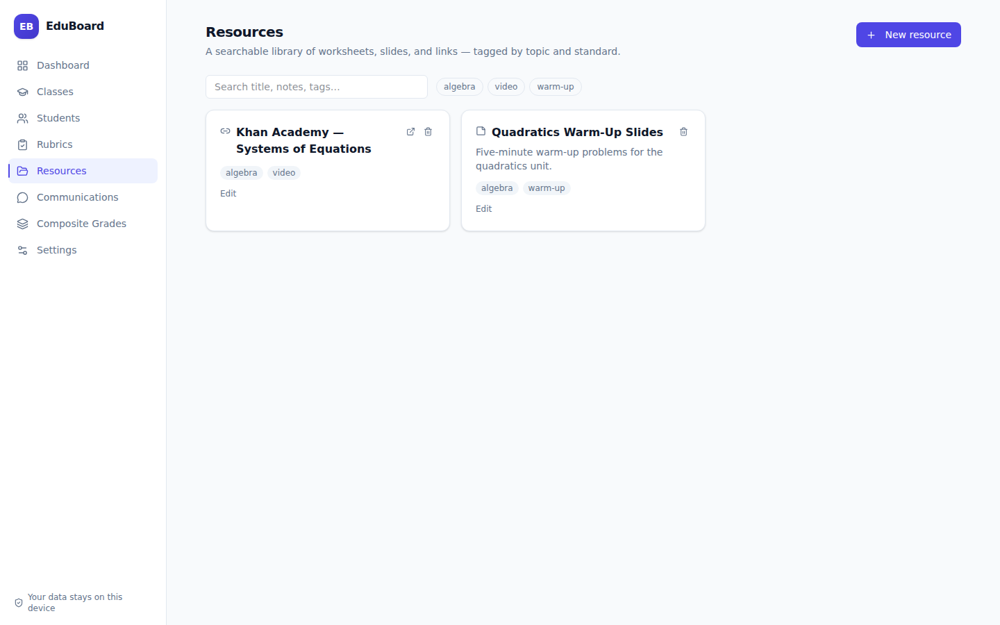

---

## Inviting students to the Portal

A class's **Portal** tab has two ways in. Neither shows anyone who else is in the class.

- **Class join link:** one link (and QR code) for the whole class. Students open it, type
  their name and date of birth, and choose a username and password. If the name matches a
  student already on your roster who has no account yet, they're matched to that student
  (if you recorded that student's date of birth, it must match). Otherwise they're added to
  the class, and appear in your roster the next time EduBoard publishes. **New link**
  replaces the link (the old one stops working), and **Turn off** closes it.
- **Personal invite links:** a link for one student on your roster. It greets them by name
  ("Hi MaiMai!") and works once. Students who already have an account are marked **Has an
  account**.

Invite strips printed before this change still work once each, and now show the same
fill-in form instead of a list of names.

---

## Students using AI

Students can use AI on the Portal in two places: the **Study Helper** (Study tab), and **Get AI help** inside each assignment. It uses the **Student AI** key from Settings. The AI is told to help them understand and plan, not to write their answer. Students are told, on screen, that you can see what they ask.

A submission shows a purple **Used AI** badge in the assignment's grading window when any of these is true:

- the student asked the AI about this assignment (from **Get AI help**);
- the student ticked **I used AI** when turning it in. The box is there for outside tools like ChatGPT too;
- their typed answer reuses wording from answers the Study Helper gave them (about 20% or more).

Hover the badge to see which, and click it to read the actual questions and answers.

What it can't see: EduBoard only knows about the Portal's own AI. Use of ChatGPT or other tools only shows up if the student ticks the box. No AI-writing "detector" is used, because none is reliable and a false accusation is worse than a missed one. Treat a text match as a reason to talk to the student, not as proof.

---

## Student logs and parent communications

Every student's profile page has a **Log** — quick-add buttons for common entries (missed homework, great participation, called home, emailed guardian) plus a free-text note with a type: **Note**, **Positive**, **Concern**, or **Contact**.

A **Contact** entry is a parent-communication record: pick how you reached them (**Phone**, **Email**, **In person**, **Other**) and, if it needs a follow-up, check **Needs follow-up**. Once you've followed up, click **Mark follow-up done** on that entry (from either the student's profile or the Communications page below).

**Communications** (sidebar) rolls up every Contact entry across every student into one searchable list — search by student name or note text, or filter to just the ones still needing follow-up. Each entry links back to that student's profile.

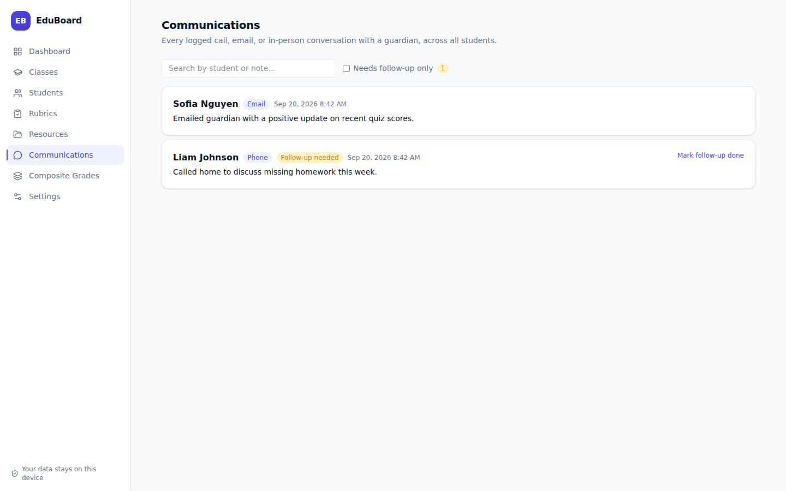

---

## Reports and report cards

**Report** (per class) shows:

- Class average, pass rate, and average attendance as headline numbers.
- Grade distribution (how many students landed in each letter grade).
- Category averages (which part of the grade the class is strongest/weakest in).
- An attendance trend line once there's more than one date recorded.
- **Export gradebook (.xlsx)** — every assessment, every score, and the computed grade, as a spreadsheet you can open in Excel or hand to an administrator.
- **Print PDF** next to each student's name — a one-page report card (grade, category breakdown, every assessment score, attendance summary) rendered straight to PDF, no extra software needed.

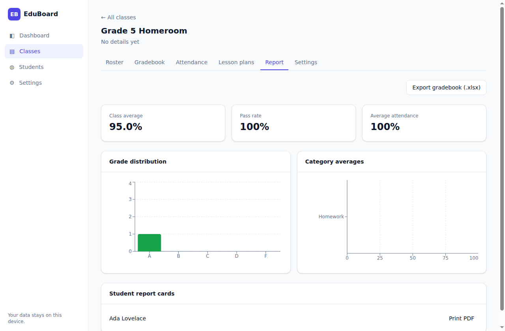

The **Dashboard** rolls all of this up across every class at once — total students, overall average, pass rate, attendance, and what's coming up in your lesson plans.

Two cards on the Dashboard help day to day. **Today** lists today's lessons from your timetable, with whether attendance is taken yet and the lesson plan for that day, plus how many parent follow-ups are due. **Students to check on** lists anyone below their class's pass mark, dropping 8 or more points over their recent scores, or with three or more concerns in their log in the last 30 days, with the reason next to each name. Neither card appears when there's nothing to show.

**Parent letters** on the Report tab prints one letter per student into a single PDF. Edit the template in the window that opens: {guardian}, {name}, {class}, {grade}, {percent}, {attendance}, {teacher}, {school} and {date} are filled in for each student. **Print letters (PDF)** also keeps your edited template for next time, and a school pack carries it too.

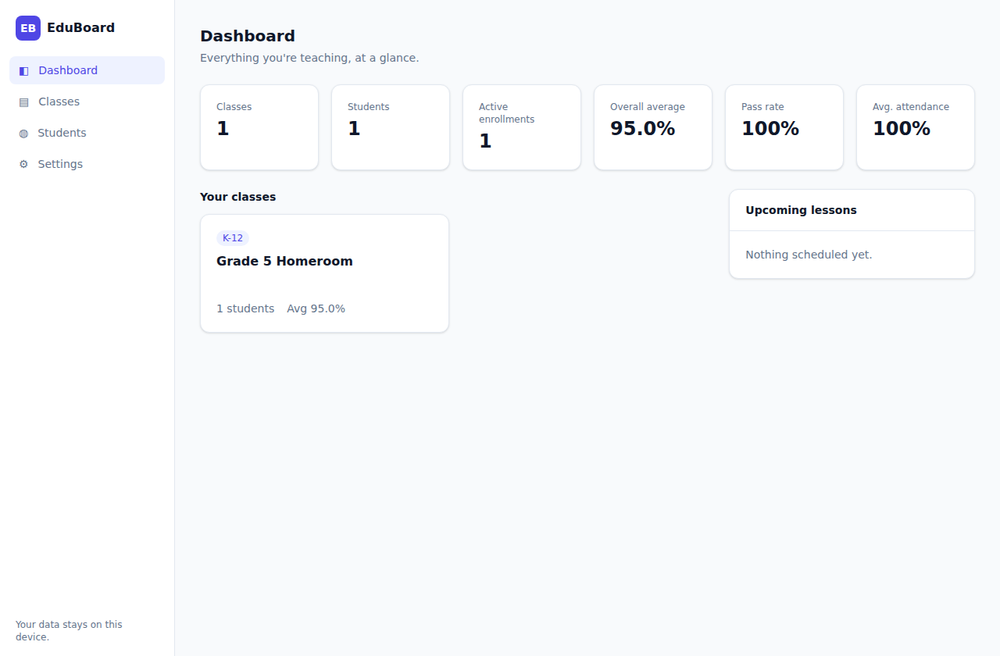

---


### Templates and report card layouts

Parent letters, Class Story posts and lesson plans each have **Start from a template…** with EduBoard's own (in the language EduBoard is in) and any you've saved. **Save as template** keeps what you've written for next time; your saved templates are listed, and can be deleted, in **Settings → Class lists → Your templates**. The report comment bank (**Settings → Grading and reports**) can **Add a ready-made set** of sentences for primary, secondary or English-as-an-additional-language classes.

**Settings → Grading and reports → Report cards** chooses what printed report cards show: **Standard** (grade, categories and every assessment), **Compact** (grade, attendance rate and comment) or **Detailed** (everything, plus signature lines for teacher and parent). Each part can be switched on or off, and you can set your own title ("End of term report") and a line printed at the bottom ("Next term starts on 2 March.").

### Report card comments

At the bottom of a class's **Report** tab, **Report card comments** has a box for each student; what you write saves when you click away and prints on their report card. **Comment bank** adds a ready-made sentence with the student's name, class, grade and percent filled in (edit the sentences in **Settings → Grading and reports → Report comment bank**, where **Add a ready-made set** adds sentences for primary, secondary or English as an additional language at the end of the list; click **Save** to keep them). **Suggest phrases** asks your AI provider (it needs an internet connection and an AI key in Settings) for a few short phrases, each marked with what it's based on (grade, trend, attendance or your notes); click one to add it, then edit. It never writes the whole comment for you. **Print all report cards (PDF)** at the top saves every student's report card in one file, a page each.

**Send report cards to families**, below the comments, sends each student's report card (the same PDF as **Print PDF**) privately to their own family on the Portal. Give it the title families will see, such as "End of Term 1 report", and click **Send**; it takes about a second per student. Families get a "New report card" notice on the Portal's Home page and find every report card under **Grades**. **Sent so far** shows how many families have opened each one; click a title to see who hasn't, and who has no Portal login yet. To correct a report card, fix it and send again with the same title: it replaces the old one and counts as unopened. **Withdraw** removes a title from the Portal. This needs the Portal to be connected (Settings → Portal and families) and updated.
## Weekly digest, your week and newsletters

The **weekly digest** is the Monday-morning email the Portal sends each family with an email on file. In **Settings → Portal and families → Weekly parent digest email**, tick what families get: grades, attendance, homework due this week, Class Story, a reminder about unread messages and, if you turn it on, each child's class points from the past week by category. It's written in the language EduBoard is in. **Settings → Portal and families → Portal sync → Preview** shows exactly what each family would receive this week, and says which families haven't given an email yet.

**Your week** (the button at the top of the Dashboard) is your own summary across every class: what you taught and what's coming up, homework due and homework not handed in, students to check on and parent follow-ups owed. **Print (PDF)** saves it; **Email it to me** sends it to the address in **Settings → Your email address**, using the same email settings as the digest.

**Newsletter** (in the sidebar) turns the week into a newsletter:

1. Tick the classes and choose who it's for: **Friendly** (families), **Pyramid** (school leaders: the main message first, then what supports it), **Simple** (young readers), or **My own sections**.
2. Tick what to include (lessons taught, lessons coming up, homework due, Class Story posts, and, if you like, class averages and attendance) and untick any single fact you don't want. Add your own notes, one per line.
3. **Arrange for me** puts everything under the headings, word for word, with no internet. **Suggest wording with AI** (needs internet) words and orders the same facts and notes; it isn't allowed to add anything, and leaves [gaps] where it would need information you haven't given.
4. Edit the text, then **Add to this week's family digest** (it goes at the top until Sunday), **Post to Class Story** (one class), **Send to group chat** (a DingTalk or WeCom group, below), or **Copy**. Fill in any [gaps] first.

Nothing about any single student goes into a newsletter.

### Class Story read receipts

Under each Class Story post, **Seen by 24 of 30 families** shows how many students' families have opened the Portal since it went up. Click it to see who hasn't yet, and how many students have no Portal login at all (their families can't see posts). Needs the updated Portal.

### Notices that need a reply (回执)

When a post needs an answer, set **Ask families to reply** before posting: **“I’ve read this”** (families confirm they've read it) or **A yes / no question** (type the question, such as "May your child come on the trip?"). On the Portal the post shows **Reply needed** with the buttons, once for each of the family's children in the class; a family can change their answer. Under the post you see **Yes / No / Not replied** (or **Confirmed by 18 of 24 families**), who hasn't replied and who answered no. **Remind** sends each family that hasn't replied a short Portal message asking them to. Needs the updated Portal.

### DingTalk and WeCom group chats

Most classes in China already have a parents' group on DingTalk (钉钉) or WeCom (企业微信). EduBoard can post into it through the group's robot:

1. In the group's settings, add a **custom robot** (DingTalk: 群设置 → 机器人 → 添加机器人 → 自定义; WeCom: 添加群机器人) and copy its **webhook address**. On DingTalk, choose **加签 (signing)** as the security setting and copy the secret too.
2. In **Settings → Portal and families → Class group chats**, **Add a group chat**, paste the address (and the DingTalk secret), choose the class, and **Send a test message**. Then **Save group**.
3. On the class's **Class Story** tab, **Also send to** sends each new post to the group as well (text only; photos stay on the Portal). On the **Newsletter** page, **Send to group chat** sends the newsletter.

It needs internet. Everyone in the group sees what you send, so keep it to class-wide news.

## Word, PowerPoint and Excel

For anything you'd rather finish in Office or WPS, EduBoard saves a file you can edit there. Nothing is uploaded; the files are made on your computer.

- **Report cards (Word)** on a class's Report tab: every student's report card (grade, attendance, categories and your comment) in one .docx, a page each.
- **Word (.docx)** in the Parent letters window: every letter, a page each, with the school logo.
- **Word** and **Slides** next to each lesson plan: the plan as a document, or a starter PowerPoint deck: a title slide in the school colour, then objectives, materials, one slide per activity (write "Warm-up: song" and the slide is headed "Warm-up") and homework.
- **Word (.docx)** on the Newsletter page, with headings and bullets kept.
- Excel: **Export gradebook (.xlsx)** on the Report tab, the course grade sheet on Composite grades, **Export everything (Excel)** in Settings → Data and security, and roster imports from .xlsx.

## Your school's look and settings

**Settings → Appearance** sets the school logo (shown in the sidebar and on report cards), the school colour, text size, higher contrast and reduced motion. **School stylesheet** there loads a `.css` file for a school's own colours, background or fonts; it's applied on top of EduBoard's look. It works by overriding EduBoard's colour names (`--color-bg`, `--color-surface`, `--color-primary`, `--color-text` and friends, for light mode on `:root` and for dark mode on `.dark`), so a stylesheet made for a website (a WordPress theme, say) changes nothing. **Save an example to start from** saves a stylesheet with every colour name in it: change the colours, then load it. After loading, EduBoard says what the file changes, or that it looks made for another website. It can use inline (`data:`) images, but anything that would load from the internet is removed.

**Settings → Class lists** edits the one-tap buttons above a student's log and adds your own student fields (such as House or Allergies). A roster import fills a field from a column with the same name. Imports also read Chinese headings (姓名, 学号, 家长姓名, 家长电话…); a single 姓名 column is split into family name and given name. These fields stay on your computer; the Portal never receives them.

**Help improve EduBoard** (at the bottom of Settings) is off unless you turn it on. When on, EduBoard tells the project once a week that this copy is still in use. It sends only what the box underneath shows: a random number made up on your computer, the version, the system and language, and rough class and student counts (as ranges). Never names, your school, grades or anything a student wrote. Turning it off forgets the random number.

**Attendance codes** (in **Your lists**) renames the four codes or adds your own, such as Sick or Field trip; each counts as present, late, absent or excused, so attendance rates stay right. In the attendance grid, click a cell to step through the codes, or right-click it to pick any code and add a note. A code you stop using is hidden rather than deleted, so days already marked with it keep counting.

**Words EduBoard uses** (also in **Your lists**) swaps EduBoard's words for your school's: "section" for "class", "test" for "assessment", "learner" for "student", "unit" for "assignment", "semester" for "term". Type the singular and plural; leave a box empty to keep EduBoard's word. In Chinese it's one box per word (教学班 for 班级, say). EduBoard reloads to use the new words.

**Settings → Data and security → School pack** puts all of the above (name, logo, colour, stylesheet, grading scale for new classes, pass mark, terms, log buttons, student fields, comment bank, parent letter) into one file. Set EduBoard up once, **Export school pack**, and share the file; colleagues use **Import school pack…**, see a list of what will change, and confirm. A pack never contains students or grades, never changes existing classes' grading scales, and only adds terms and student fields.

## Password protection

**Settings → Data and security → Password protection → Turn on password protection** encrypts everything EduBoard keeps (students, grades, notes, guardian contacts, and the Portal and AI keys in Settings), so the database file is unreadable without your password. Recommended if the computer is shared, goes home with you, or your data lives on a USB stick.

1. Choose a password (at least 8 characters). EduBoard backs up first, then encrypts.
2. You get a **recovery key** (five groups of letters and numbers). Write it down or print it and keep it away from the computer. **If you forget your password, the recovery key is the only way in**; nobody can recover your data without one of them.
3. From then on EduBoard asks for the password when it opens. On the lock screen, **Forgot your password? Use your recovery key** takes the recovery key instead.

EduBoard also locks itself after a while with no keyboard or mouse use (**Lock after**: 5, 10, 15, 30 or 60 minutes, or never), whenever the computer locks or goes to sleep, and when you press the lock icon at the bottom of the sidebar or **Lock now**. While it's locked, an exit ticket or attendance check-in you've started keeps collecting answers, and backups keep running.

After five wrong tries, EduBoard makes you wait 30 seconds between tries.

**Backups** of a protected database are encrypted too. Each one keeps a copy of the lock it was made with, so a backup still restores after you change your password; EduBoard then asks for the password you had when the backup was made, or that time's recovery key. Backups made **before** you turned protection on can still be read without a password: the Password protection panel counts them and offers **Delete unprotected backups**.

**Change password** keeps the same recovery key. **Turn off** decrypts your data again (it asks for your password first).

## Presenting on a projector

Press the **projector icon** at the top of the sidebar before putting EduBoard on the big screen. While presenting, pages with grades, notes, contact details or keys (Dashboard, Students, Gradebook, Report, Homework, Portal, Analytics, Messages, Communications, Audit Log and Settings) show *Hidden while presenting* instead, and attendance rates are blurred. The pages a class normally sees stay as they are: seating chart, exit ticket, attendance (with its QR check-in), lesson plans, class story, timetable, calendar, resources and rubrics. **Stop presenting** in the banner, or the icon again, turns it off.

## A student's or family's data request

On a student's page, **Their data** has two buttons:

- **Download their data** saves everything EduBoard holds about the student (their details and every record that refers to them) as a file you can pass on.
- **Erase all their data…** removes the student and every record about them, including their history in the audit log, and rewrites the database file so nothing is left in it. Unlike **Delete**, it takes no backup first and can't be undone; type the student's name to confirm. Backups made before then still contain the student until they're replaced or you delete them. If you use the Portal, **Delete** and **Erase** also remove the student there: their login, handed-in work, profile and Study Helper history. If the Portal can't be reached at that moment, it happens the next time you publish.

## Backing up your data

**Settings → Data and security → Backups → Back up now** makes a timestamped copy of your entire database. Do this before anything you'd hate to redo (a big import, end of term) — it takes a second. **Open folder** shows you where backups live on disk, so you can copy one to a USB stick, a cloud-synced folder, or email it to yourself.

**Export everything (Excel)** saves all your data as one workbook, a sheet per table. It's for reading, a school's records or moving to another system; to move EduBoard itself to a new computer, use a backup.

**Restore** replaces everything currently in EduBoard with a chosen backup and restarts the app — use it if something goes wrong or you're setting up on a new computer from an old backup.

There's no auto-sync or cloud anything here on purpose: EduBoard doesn't talk to the internet at all. Backups are the whole safety net, so it's worth actually using them.

---

## Carrying EduBoard on a USB stick

This is what the **portable** Windows build (and, less formally, the macOS `.app` or Linux AppImage) is for:

1. Copy `EduBoard-Portable.exe` (or the `.AppImage`, or the extracted `.app`) onto the USB stick.
2. Run it once from the stick — it creates its data folder right there next to itself.
3. From then on, plug the stick into any compatible computer and run the exe directly off it. Your classes, students, grades, and attendance travel with it, no install needed on the host machine.

Two things worth knowing:
- Writing to a USB stick is slower than a local disk, so very large rosters may feel a little less snappy — fine for typical class sizes.
- Back up periodically (see above) — a lost or corrupted USB stick is the one single point of failure in this setup, same as it would be for any file you keep only on a flash drive.

---

## Troubleshooting

**An error message ends with a code, such as (EB-1003) or (PT-3001).**
The code says what went wrong: EB codes come from EduBoard on your computer, PT codes from the Portal. [ERROR_CODES.md](ERROR_CODES.md) lists every code, what it means and what to do. When you ask for help, give the code. **Settings → Help and updates** lists your recent errors, and **Copy error report** copies EduBoard's version, your system and those errors to send. If a message says "ref" and six letters (for example EB-0900 · ref 7KQ2MX), include that too: it points to the full details in the error log. If a screen can't be drawn, EduBoard shows "This screen couldn't be shown" with a code and a **Reload** button; your data is safe.

**Windows says "Windows protected your PC" / macOS says the app "cannot be opened."**
Expected — see [Installing](#installing) above. It's a code-signing warning, not a real error.

**I imported a roster and some students didn't show up.**
Check the import result message: rows missing a first *and* last name are skipped and reported, not silently dropped. Fix the source file and re-import — duplicate students aren't automatically merged, so check your directory for repeats if you import the same file twice.

**A student's grade shows "—" even though I entered scores.**
Grades only compute once a category (or the whole class, if you're not using categories) has at least one graded assessment. If you're using categories, an assessment must be assigned to one for it to count toward category-weighted totals — assessments left "Uncategorized" still count, just folded in unweighted.

**I want to move EduBoard's data to a different computer.**
Use **Settings → Data and security → Backups**, make a fresh backup, copy the `.db` file to the new machine (or the new machine's version of EduBoard), and use **Restore** to load it. For the portable build, it's simpler still: just copy the exe and its `EduBoard-data` folder together.

**Something looks broken.**
Please open an issue on the [GitHub repo](https://github.com/purysho/EduBoard/issues) with what you were doing and what you expected instead — screenshots help a lot.
